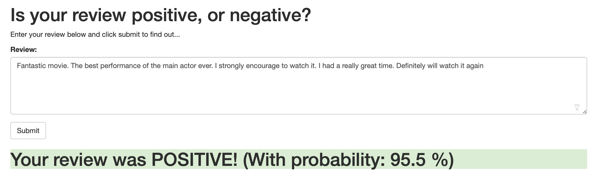
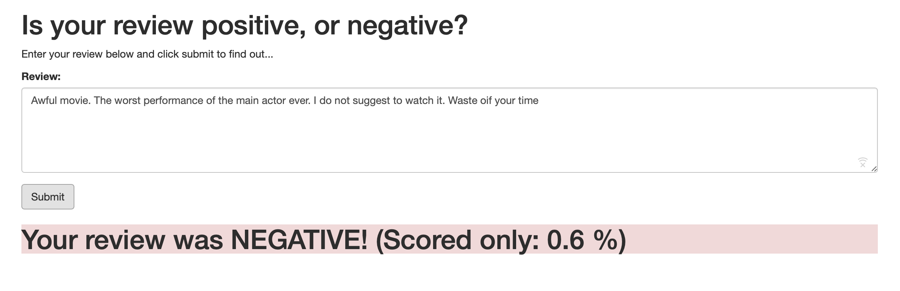

# Sentiment Analysis LSTM model with Sagemaker and PyTorch

Repository contains end to end sentiment analysis model creation (using LSTM),
and deployment steps to create a simple functional web app in front of the created model, hosted on SageMaker endpoint.

All the steps are documented in the [notebook](https://github.com/bdnf/sagemaker-deployment/blob/master/SageMaker%20Project.ipynb).

# Deployment Architecture

The diagram above gives an overview of how the various services will work together. On the far right is the model which we trained above and which is deployed using SageMaker. On the far left is our web app that collects a user's movie review, sends it off and expects a positive or negative sentiment in return.

In the middle is where some of the magic happens. Constructed **AWS Lambda** function, which you can think of as a straightforward Python function that can be executed whenever a specified event occurs. The function has permission to send and recieve data from a SageMaker endpoint.

We use **API Gateway** as an endpoint to invoke described Lambda function. This endpoint will be a url that listens for data to be sent to it. Once it gets some data it will pass that data on to the Lambda function and then return whatever the Lambda function returns. Essentially it will act as an interface that lets our web app communicate with the Lambda function.

# Example web interface:

----
**Technologies used:**
  Python 3.6
  Libraries:
- PyTorch to Machine Learning
- pandas
- numpy
- nltk
- beautifulsoup4
- html5lib

AWS:
- Sagemaker
- IAM
- Lambda
- API Gateway
